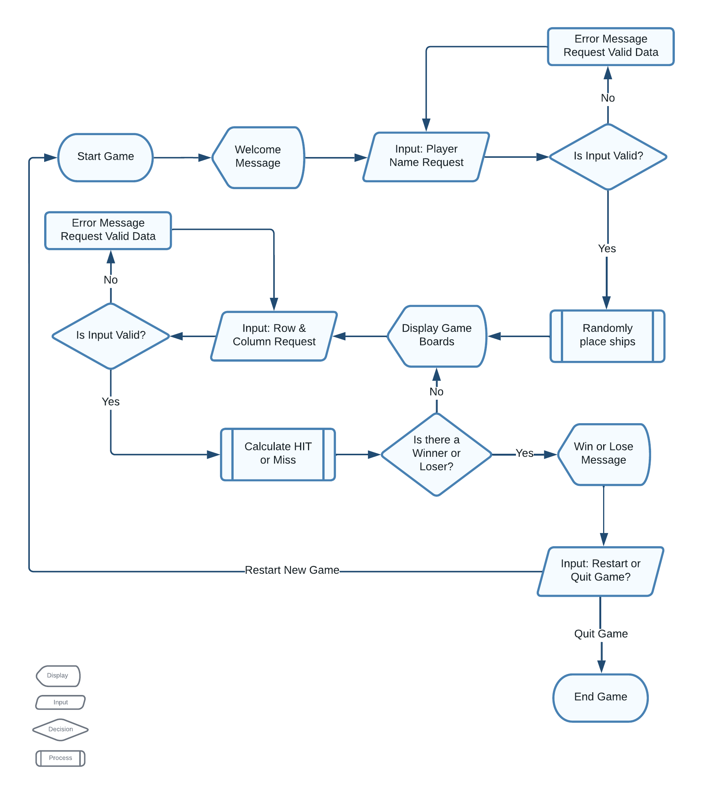
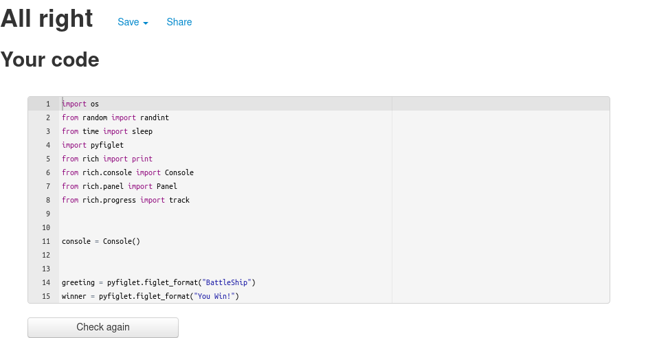

# Battleship Python Terminal Game

[You can view the live project here.]()

## Project Overview

Battleships is a python terminal game, which runs in the Code Institute mock terminal deployed on Heroku. Battlehship is a strategy type guessing game for two players. You can read more about the history, origins and [view further details here](https://en.wikipedia.org/wiki/Battleship_(game)).

## Table of contents

* [How to Play](#how-to-play)
* [Features](#features)
    * [Existing Features](#existing-features)
    * [Future Features](#existing-features)
* [Data Model](#data-model)
* [Game Logic Flow](#game-logic-flow)
* [Testing](#testing)
    * [Manual Testing](#manual-testing)
    * [Validator Testing](#validator-testing)
* [Deployment](#deployment)
* [Technologies Used](#technologies-used)
* [Credits](#credits)
* [Acknowledgments & References](#acknowledgments--references)

## How To Play

In this version the user is greeted with a welcome screen that displays the object of the game and helpful key of symbols used during gameplay. 

Once asked for the users name the ship placement for both players is randomly generated and the targeting systemt activates. The user is requested to input their shot destination by row and column. The firing simulation plays and the results of both shots displayed. If the player wins the game then the winner message is displayed along with the result and board display of the winning shot. If the player loses the game then the loser message is displayed along with the result and board display of the computers winning shot. With both end of game messages the user then has the option to either quit of restart a new game.

The player can see where their ships are, indicated by `@`, but cannot see where the computer's ships are. Guesses are marked on the board with an `x`. Hits are indicated by a `*`. Each board space is marked with a `~` to simulate water. The key below is displayed during the game for easy reference.

Hit * | Miss X | Water ~ | Ship @

The player and the computer then take it in turns to make the guesses and try to sink each others battleships. The winner is the player who sinks all of their opponents battlships first.

## Features

### Existing Features

* Welcome Screen
    
    * Explains to the user the object of the game
    * Provides a gameplay key explaining the emoji symbols used
    * Allows player to set their name for the game

* Random board generation

    * Ships are randomly placed on both the player and computer boards
    * Placement of computer boards is hidden from the user

* Accepts user input

* Error Checking and Input Validation

    * You cannot enter coordinates outside the size of the grid

    

    * You must enter numbers

    

    * You cannot enter the same guess twice

    

* Missile launch progress display

    * Once the player makes their choice a progress bar simulates a missile launch sequence before showing shot results

    

* Shot Results Display

    * After the launch sequence the screen refreshes and confirms the results of the player and computer shot results. The game boards are reprinted with the hit or miss shown on the boards.

    

* End Game Display

    * **You Lose** - Displays last shot result and player board to show where the last shot landed. Results graphic displays You lose message. Give the user the ability to restart a new game or quit current game.

    

    * **You Win** - Displays last shot result and player board to show where the last shot landed.Results graphic displays You lose message. Give the user the ability to restart a new game or quit current game.

    

(<a href="#top">back to top</a>)

### Future Features

* Keep Score and display after each round
* Allow player to select the board size and number of ships
* Add a turn counter which ends game once all turns used
* Allow player to position ships themselves 
* Allow player to select a difficulty level
* Have multiple ships sizes larger than 1x1

(<a href="#top">back to top</a>)

## Data Model

The game uses a board class as the model. The game creates two instances of the board class to hold the player's and the computer's board.

The board class stores the board size, the number of ships, the position of the ships, the guesses against the board, and details such as the board type (player's board or computer) and the player name. Helper functions are used to assist the board class.

(<a href="#top">back to top</a>)

## Game Logic Flow

The chart below gives an overview of the game logic flow.

(<a href="#top">back to top</a>)

## Testing

### Manual Testing

I have manually tested this project by completing the following:

* During development the code was passed through the PEP8 validator before each commit.

* I manually tested the input validation as follows:

    * Out of bounds inputs - Confirmed error message and validation loop requesting correct data input.

    

    * Strings when numbers are expected -- Confirmed error validation loop requesting correct data input.

    

    * Same input twice - - Confirmed error message and validation loop requesting correct data input.

    

    * Player Name Input - - Confirmed error message and validation loop requesting correct data input.

    

### Validator Testing

* PEP8
    * No errors were returned from [PEP8online.com](http://pep8online.com/)

    

(<a href="#top">back to top</a>)

## Deployment

### Local Deployment

*Gitpod* IDE was used to write the code for this project.

To make a local copy of this repository, you can clone the project by typing the follow into your IDE terminal:
- `git clone https://github.com/r3b3l-dev/battleship.git`

Alternatively, if using Gitpod, you can click below to create your own workspace using this repository.

### Heroku Deployment

Deployment steps are as follows, after you have an account setup:

- Select *New* in the top-right corner of your Heroku Dashboard, and select *Create new app* from the dropdown menu.
- Your app name must be unique, and then choose a region closest to you (EU or USA), and finally, select *Create App*.
- From the new app *Settings*, click *Reveal Config Vars*, and set the value of KEY to `PORT`, and the value to `8000` then select *add*.
- Further down, to support dependencies, select *Add Buildpack*.
- The order of the buildpacks is important, select `Python` first, then `Node.js` second. (if they are not in this order, you can drag them to rearrange them)

Heroku needs two additional files in order to deploy properly.
- requirements.txt
- Procfile

You can install this project's requirements (where applicable) using: `pip3 install -r requirements.txt`. If you have your own packages that have been installed, then the requirements file needs updated using: `pip3 freeze --local > requirements.txt`

The Procfile can be created with the following command: `echo web: node index.js > Procfile`

For Heroku deployment, due to recent security issues, users can no longer deploy via the Heroku Dashboard. Follow these steps to connect your GitHub repository to the newly created app:

- In the Terminal/CLI, connect to Heroku using this command: `heroku login -i`
- Set the remote for Heroku: `heroku git:remote -a <app_name>` (replace app_name with your app, without the angle-brackets)
- After performing the standard Git `add`, `commit`, and `push` to GitHub, you can now type: `git push heroku main`

The frontend terminal should now be connected and deployed to Heroku.

(<a href="#top">back to top</a>)

## Technologies Used

### Primary Language

[Python](https://www.python.org/) - This program was written in Python.

### Code Repository, Writing, and Version Control

[Gitpod](https://gitpod.io) - Used for development as the cloud-based IDE.

[GitHub](https://github.com/) - Used for securing my code online.

[Git](https://git-scm.com/) - Used for version control (`git add`, `git commit`, `git push`)

### Python Standard Library Modules

[OS](https://docs.python.org/3/library/os.html) - Used for clearing the terminal to enhance user experience.

[Random](https://docs.python.org/3/library/random.html) - Used randint for generating random coordinates.

[Time](https://docs.python.org/3/library/time.html) - Used sleep for suspending execution of next thread to enhance user experience.

### External Libraries

[pyFiglet](https://github.com/pwaller/pyfiglet) - pyFiglet takes ASCII text and renders it in ASCII art fonts. In this project it was used to create the header text on the welcome screen and the win/lose end of game messages.

[Rich](https://github.com/Textualize/rich) - Rich is a Python library for rich text and beautiful formatting in the terminal. In this project it was used to add colour and panels to surround the pyfiglet game messages.

### Deployment

[Heroku](https://www.heroku.com) - Used to display the terminal view of this backend application in a modern web browser.

(<a href="#top">back to top</a>)

## Credits

-   Code Institute for the terminal.

-   Wikipedia for the details of the Battleships game.

(<a href="#top">back to top</a>)

## Acknowledgments & References

- External references for specific code is included in comments. These are from [StackOverflow](https://stackoverflow.com/). Inspiration came from battleship project by [TimRas](https://github.com/TimRas/BattleShip.git) combined with [Code Institute](https://codeinstitute.net/ie/) tutorials.

(<a href="#top">back to top</a>)

### Disclaimer

(<a href="#top">back to top</a>)
